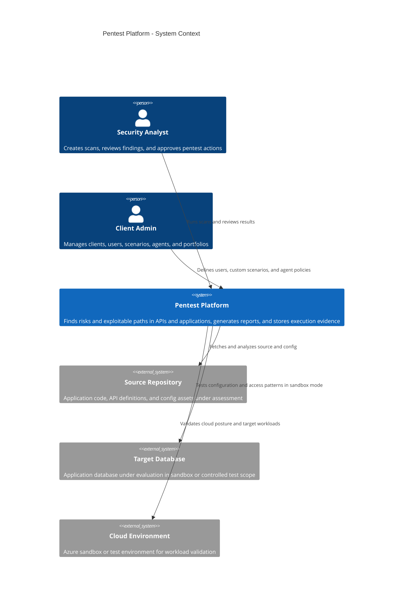
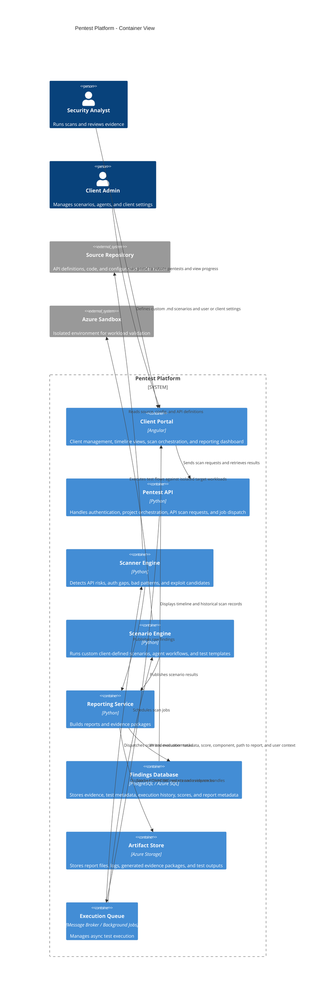
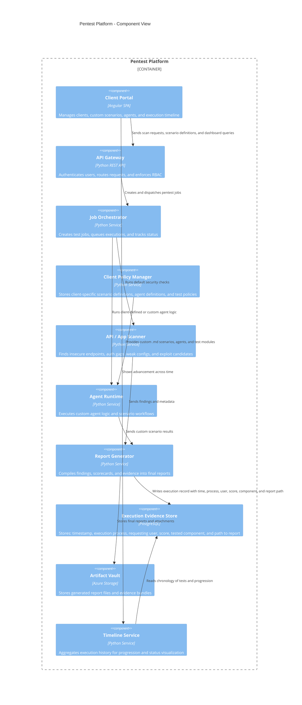

# C4 Architecture

This folder contains the C4-based architecture model for the pentest platform.

## 1. System Context

## 2. Container View

## 3. Component View

## 4. Design Notes
- The portal is the user-facing control plane for managing tests, clients, and scenarios.
- The backend orchestrates jobs and routes results to the reporting and evidence services.
- Custom `.md` scenarios and agent definitions are first-class extensions to the default pentest engine.
- Execution history is tracked by timeline and stored in a structured evidence database.
- All results must be attributable to a user, process, and time of execution for audit purposes.
