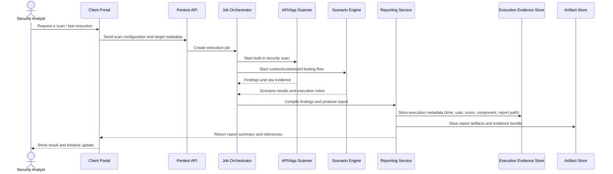
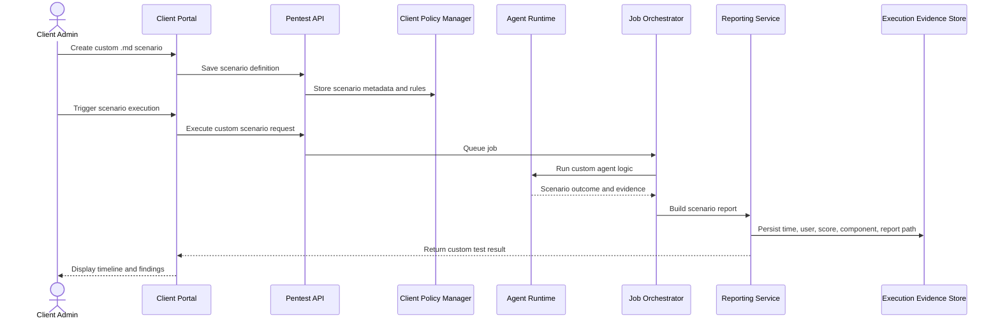
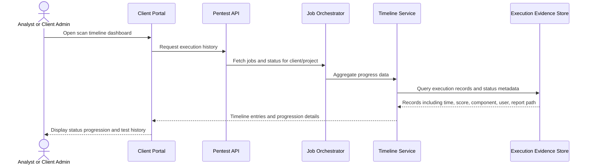
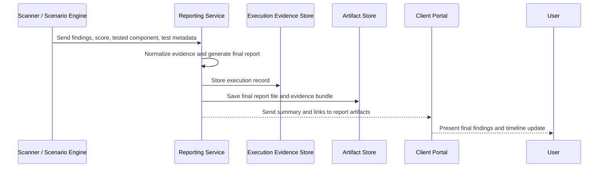
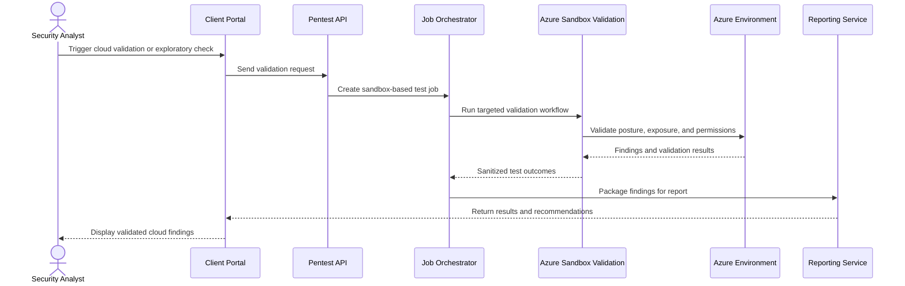

# Flow Diagrams

This folder contains sequence diagrams that describe the core business flows of the pentest platform.

## 1. Scan Execution Flow

## 2. Custom Scenario Flow

## 3. Timeline Progression Flow

## 4. Report Generation Flow

## 5. Cloud Sandbox Validation Flow

## 6. Notes
These flows capture the platform’s main lifecycle:

- start a scan or custom test
- run built-in or custom logic
- produce structured evidence
- save execution metadata in the database
- render the result and progression timeline to the client portal
