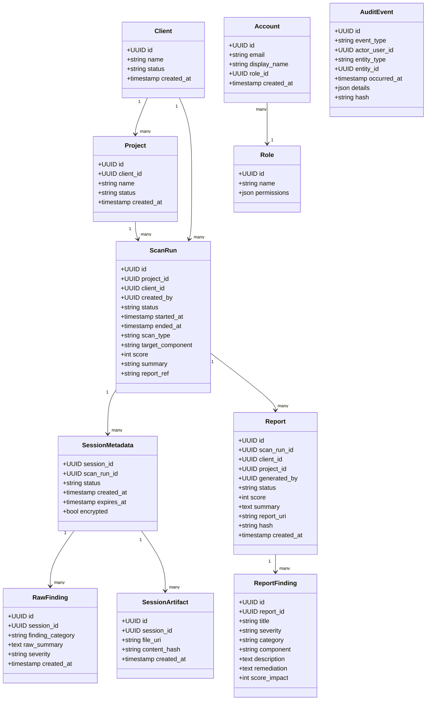

# Preliminary Database Schema

This document defines the preliminary schema for the privacy-safe data model of the pentest platform.

## 1. Main Application Database

### 1.1 `clients`
| Column | Type | Description |
|---|---|---|
| id | UUID | Client primary key |
| name | VARCHAR | Client name |
| status | VARCHAR | Active / disabled / archived |
| created_at | TIMESTAMP | Creation time |
| created_by | UUID | User who created the client |
| retention_policy | JSONB | Client-defined retention rules |

### 1.2 `projects`
| Column | Type | Description |
|---|---|---|
| id | UUID | Project primary key |
| client_id | UUID | Linked client |
| name | VARCHAR | Project name |
| description | TEXT | Sanitized project summary |
| status | VARCHAR | Active / paused / completed |
| created_at | TIMESTAMP | Creation time |
| created_by | UUID | User who created the project |

### 1.3 `accounts`
| Column | Type | Description |
|---|---|---|
| id | UUID | Account primary key |
| email | VARCHAR | User email |
| display_name | VARCHAR | User name |
| role_id | UUID | Linked role |
| created_at | TIMESTAMP | Creation time |
| is_active | BOOLEAN | Account status |
| last_login_at | TIMESTAMP | Last successful login |

### 1.4 `roles`
| Column | Type | Description |
|---|---|---|
| id | UUID | Role primary key |
| name | VARCHAR | Role name |
| permissions | JSONB | Allowed permissions |
| description | TEXT | Role description |

### 1.5 `scan_runs`
| Column | Type | Description |
|---|---|---|
| id | UUID | Scan run primary key |
| project_id | UUID | Linked project |
| client_id | UUID | Linked client |
| created_by | UUID | Requesting user |
| status | VARCHAR | queued / running / completed / failed |
| started_at | TIMESTAMP | Run start time |
| ended_at | TIMESTAMP | Run end time |
| scan_type | VARCHAR | api / app / custom / scenario |
| target_component | VARCHAR | Tested component or endpoint |
| score | SMALLINT | 1–10 score |
| summary | TEXT | Sanitized high-level summary |
| report_ref | VARCHAR | Reference to artifact/report |

### 1.6 `audit_events`
| Column | Type | Description |
|---|---|---|
| id | UUID | Audit event primary key |
| event_type | VARCHAR | Action type |
| actor_user_id | UUID | User who triggered the event |
| entity_type | VARCHAR | Related object type |
| entity_id | UUID | Related object ID |
| occurred_at | TIMESTAMP | Event time |
| details | JSONB | Redacted metadata |
| hash | VARCHAR | Integrity hash |

## 2. Session Database Schema
The session database is per verification run and is temporary. It is not part of the main long-term system-of-record.

### 2.1 `session_metadata`
| Column | Type | Description |
|---|---|---|
| session_id | UUID | Unique session identifier |
| scan_run_id | UUID | Parent scan run |
| status | VARCHAR | active / finalizing / expired |
| created_at | TIMESTAMP | Session creation |
| expires_at | TIMESTAMP | Auto-delete time |
| encrypted | BOOLEAN | Whether the session is encrypted |

### 2.2 `raw_findings`
| Column | Type | Description |
|---|---|---|
| id | UUID | Raw finding record |
| session_id | UUID | Associated session |
| finding_category | VARCHAR | Category / class |
| raw_summary | TEXT | Raw, internal summary before sanitization |
| severity | VARCHAR | Low / medium / high / critical |
| created_at | TIMESTAMP | Creation time |
| source_ref | VARCHAR | Link to raw file or artifact |

### 2.3 `session_logs`
| Column | Type | Description |
|---|---|---|
| id | UUID | Log entry primary key |
| session_id | UUID | Session reference |
| log_level | VARCHAR | INFO / WARN / ERROR |
| message | TEXT | Execution log content |
| created_at | TIMESTAMP | Log time |

### 2.4 `session_artifacts`
| Column | Type | Description |
|---|---|---|
| id | UUID | Artifact entry |
| session_id | UUID | Associated session |
| file_uri | VARCHAR | Artifact path or object URI |
| content_hash | VARCHAR | Integrity hash |
| created_at | TIMESTAMP | Artifact creation time |
| redacted | BOOLEAN | Whether artifact was sanitized |

## 3. Report Index Database
This database stores the final report references and metadata needed for access and governance.

### 3.1 `reports`
| Column | Type | Description |
|---|---|---|
| id | UUID | Report primary key |
| scan_run_id | UUID | Related scan run |
| client_id | UUID | Related client |
| project_id | UUID | Related project |
| generated_by | UUID | User or process that produced it |
| status | VARCHAR | draft / approved / archived / deleted |
| score | SMALLINT | Final score 1–10 |
| summary | TEXT | Sanitized summary |
| report_uri | VARCHAR | Location of final report artifact |
| hash | VARCHAR | Report integrity hash |
| created_at | TIMESTAMP | Report generation time |
| retained_until | TIMESTAMP | Retention expiry |

### 3.2 `report_findings`
| Column | Type | Description |
|---|---|---|
| id | UUID | Finding record |
| report_id | UUID | Linked report |
| title | VARCHAR | Sanitized issue title |
| severity | VARCHAR | Risk level |
| category | VARCHAR | Category tag |
| component | VARCHAR | Tested component |
| description | TEXT | Sanitized description |
| remediation | TEXT | Planned remediation |
| score_impact | SMALLINT | Impact score |

## 4. Artifact Store Layout
The artifact store should be organized as follows:

- `clients/{client_id}/projects/{project_id}/runs/{run_id}/reports/`
- `clients/{client_id}/projects/{project_id}/runs/{run_id}/evidence/`
- `clients/{client_id}/projects/{project_id}/runs/{run_id}/logs/`
- `clients/{client_id}/projects/{project_id}/reports/`

Note: Each artifact should be encrypted and access-controlled. Report files and evidence bundles should be separated by role and retention policy.

## 5. UML Diagram (Conceptual)

## 6. Security Notes
- Raw findings live in the temporary session layer, not the permanent app DB.
- Only sanitized metadata remains in long-term storage.
- All evidence and reports should be encrypted and access-controlled.
- Hashes should be created for evidence integrity checks and audit review.
- Retention boundaries should be enforced by policy and automated cleanup.
