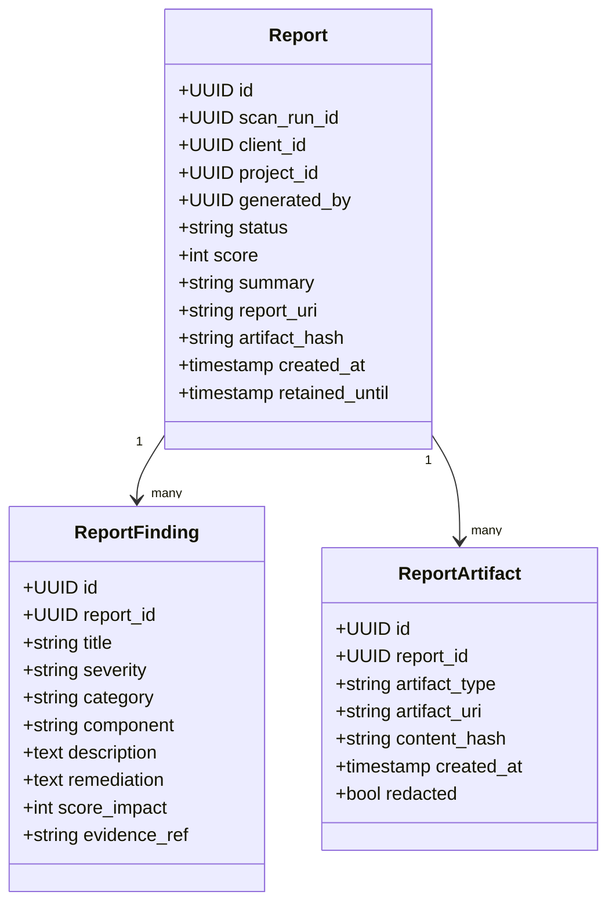

# Report Index Schema

## Purpose
The report index database stores the final summary metadata for completed pentest runs and their related artifacts.

## Table: `reports`
| Column | Type | Description |
|---|---|---|
| id | UUID | Unique report ID |
| scan_run_id | UUID | Related scan or run ID |
| client_id | UUID | Client owning the report |
| project_id | UUID | Project associated with the report |
| generated_by | UUID | User or process that created the report |
| status | VARCHAR | draft / approved / archived / deleted |
| score | SMALLINT | Final risk score from 1 to 10 |
| summary | TEXT | Sanitized summary of the assessment |
| report_uri | VARCHAR | URI or storage path for the final report artifact |
| artifact_hash | VARCHAR | Integrity hash of the report artifact |
| created_at | TIMESTAMP | Report creation time |
| retained_until | TIMESTAMP | Retention expiry |
| classification | VARCHAR | Public / internal / confidential / restricted |

## Table: `report_findings`
| Column | Type | Description |
|---|---|---|
| id | UUID | Finding ID |
| report_id | UUID | Parent report |
| title | VARCHAR | Sanitized issue title |
| severity | VARCHAR | low / medium / high / critical |
| category | VARCHAR | CWE, category, or test family |
| component | VARCHAR | Tested component or endpoint |
| description | TEXT | Sanitized issue summary |
| remediation | TEXT | Recommended remediation |
| score_impact | SMALLINT | Impact score |
| evidence_ref | VARCHAR | Reference to artifact or evidence item |

## Table: `report_artifacts`
| Column | Type | Description |
|---|---|---|
| id | UUID | Artifact record ID |
| report_id | UUID | Linked report |
| artifact_type | VARCHAR | report / evidence / screenshot / export |
| artifact_uri | VARCHAR | Storage location |
| content_hash | VARCHAR | Hash of artifact |
| created_at | TIMESTAMP | Artifact creation time |
| redacted | BOOLEAN | Whether sensitive content was removed |

## UML Conceptual View

## Notes
- This schema is intentionally sanitized and minimal.
- It stores references to artifacts, not the raw evidence itself.
- Final reports should be treated as part of the retention lifecycle and subject to client privacy rules.
